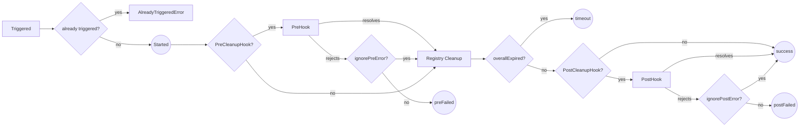
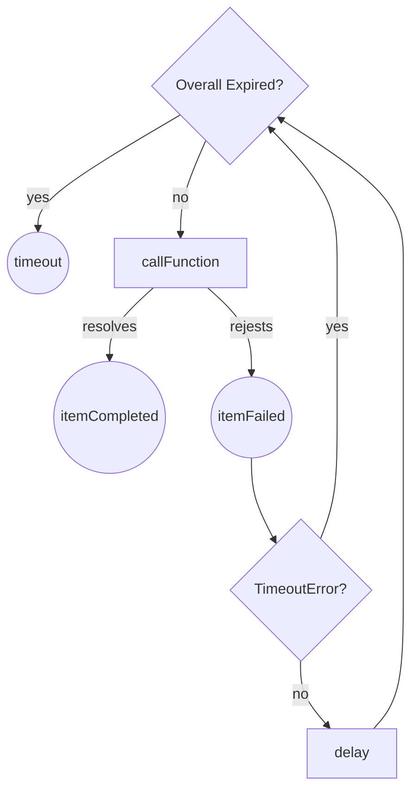

# cleanup-registry
a package for calling async functions to be resolved in a configured loop

# Install
```
npm install @map-colonies/cleanup-registry
```

# Usage
1. import cleanup-registry:
```ts
import { CleanupRegistry } from '@map-colonies/cleanup-registry';
```

2. create your registry with wished options:
```ts
const registry = new CleanupRegistry({
    overallTimeout: 3000,
    preCleanupHook: async (): Promise<void> => Promise.resolve(),
  });
```

3. register your async functions:
```ts
registry.register({
    func: myAsyncFunc,
    id: 'funcId',
    timeout: 100,
    timeoutAfterFailure: 300
});
```

4. optionally listen to your wanted events:
```ts
registry.on('itemCompleted', (id) => console.info({ msg: 'item completed', id }));
registry.on('itemFailed', (id, error, message) => console.error({ err: error, msg: message, id }));
registry.on('started', () => console.info('started'));
registry.on('finished', (status) =>
    status === 'success' ?
    console.info('finished successfully') :
    console.error({ msg: 'finished with bad status', status })
);
```

4. trigger the registered functions
```ts
await registry.trigger();
```

## How it works
The cleanup process as a whole:


Cleaning up the registry will result in each item independent cleanup loop:


# Configuration
## RegistryOptions
- `overallTimeout`: the duration in ms for all the registered functions to complete. when expired new function completion attempts will cease and a `finished` event with `timeout` status will be emitted.
defaults to 10000.
- `preCleanupHook`: an async function to be called before any of the registered functions will be called.
- `postCleanupHook`: an async function to be called after all registered functions have completed.
## ItemOptions
- `func`: an async function for registration
- `id`: the id to be attached to the item on `itemCompleted`, `itemFailed` events and `remove` function, could be a string or a symbol, if no id is provided a random uuid will be set.
- `timeout`: the duration in ms for the function to be resolved in a single attempt, when expired `itemFailed` event will be emitted with a `TimeoutError` as error. defaults to 1000.
- `timeoutAfterFailure`: the duration in ms for the function to be delayed after inner function rejection (not due to timeout), only when expired a new attempt will be made. defaults to 500.

## TriggerOptions
- `ignorePreError`: should ignore rejection by `preCleanupHook`, when falsy and `preCleanupHook` rejects a finished event with `preFailed` will be emitted and the cleanup process will stop. defaults to true.
- `ignorePostError`: should ignore rejection by `postCleanupHook`, if falsy and `postCleanupHook` rejects a finished event with `postFailed` will be emitted. defaults to true.

# Events
optionally listen to the following events:
- `started`: the registry had started the cleanup process.
- `itemCompleted`: a registered function promise has been resolved, the item id is provided.
- `itemFailed`: a registered function promise had rejected, this could be due to inner function rejection or the item timed out. the item id, the rejecting error and possibly a message are provided.
- `finished`: the cleanup process has completed, the finish status is provided. finish status is one of the following statuses:
    - `success`: all registered functions had completed successfully
    - `timeout`: the registry timeout had expired before all registered functions have completed
    - `preFailed`: the preCleanupHook had rejected
    - `postFailed`: the postCleanupHook had rejected

# Tests
```
npm test
```
