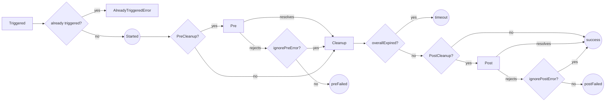

# cleanup-registry
a package for calling async functions to be resolved in a configured loop

# Install
```
npm i cleanup-registry
```

# Usage
1. create you registry with wished options
```ts
const registry = new CleanupRegistry({
      overallTimeout: 3000,
      preCleanup: async (): Promise<void> => {
        logger.debug({ message: 'this is a pre cleanup function'})
        return new Promise((resolve, _) => resolve());
      },
    });
```

2. listen to your wanted events
```ts
registry.on('started', () => logger.info({ msg: 'cleanup started'}));
registry.on('itemCompleted', (id) => logger.info({ msg: `item ${id.toString()} completed` }));
registry.on('itemFailed', (id, error, message) => logger.error({ err: error, msg: message, id }));
registry.on('finished', (status) =>
    status === 'success' ?
    logger.info(`finished successfully`) :
    logger.error({ msg: `finished with error`, status }));
```

3. register your async functions
```ts
registry.register({
    func: myAsyncFunc,
    id: 'funcId',
    timeout: 100,
    timeoutAfterFailure: 300
});
```

4. trigger the registered functions
```ts
await registry.trigger();
```

# Configuration
## RegistryOptions
- `overallTimeout`: the duration in ms for all the registered functions to complete. when timeout duration is passed new function completion attempts will cease and a `finished` event with `timeout` status will be emitted.
defaults to 10000.
- `preCleanup`: an async function to be called upon triggering the registry before any of the registered functions will be called.
- `postCleanup`: an async function to be called after all registerd functions have completed.
## ItemOptions
- `func`: an async function for registration
- `id`: the id to be attached to the item on `itemCompleted` and `itemFailed` events and `remove` function, could be a string or a symbol, if no id is given a random uuid will be set.
- `timeout`: the duration in ms for the function to be resolved in a single attempt, when passed an `itemFailed` event will be emitted with a `TimeoutError` as error. defaults to 1000.
- `timeoutAfterFailure`: the duration in ms for the function to be delayed after inner rejection (not due to timeout), when passed a new attempt will be made. defaults to 500.

## TriggerOptions
- `ignorePreError`: should ignore rejection by `preCleanup` hook, if not ignored and `preCleanup` rejects a finished event with `preFailed` will emit. defaults to true.
- `ignorePostError`: should ignore rejection by `postCleanup` hook, if not ignored and `postCleanup` rejects a finished event with `postFailed` will emit. defaults to true.

# Events
it is possible to listen to the following events:
- `started`: the registry had started the cleanup process
- `itemCompleted`: a registered function promise has resolved, the listener will get the item id
- `itemFailed`: a registered function promise has rejected, this could be due to inner function rejection or item timeout, the listener will get the item id, the rejecting error and possibly a message
- `finished`: the cleanup process has completed, the listener will get the finish status, which is one of the following statuses:
    - `success`: all registered funtions had completed
    - `timeout`: the registry timeout had expired before all registered functions have completed
    - `preFailed`: the preCleanup had rejected
    - `postFailed`: the postCleanup had rejected

## How it works
the cleanup trigger as a whole:


a single function cleanup loop:

# Tests
```
npm test
```